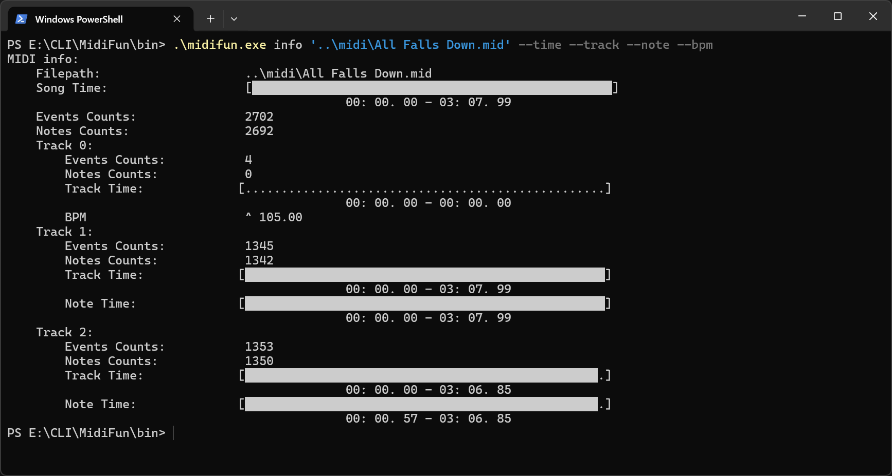
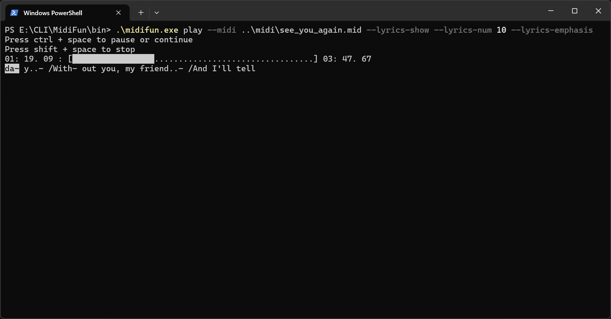
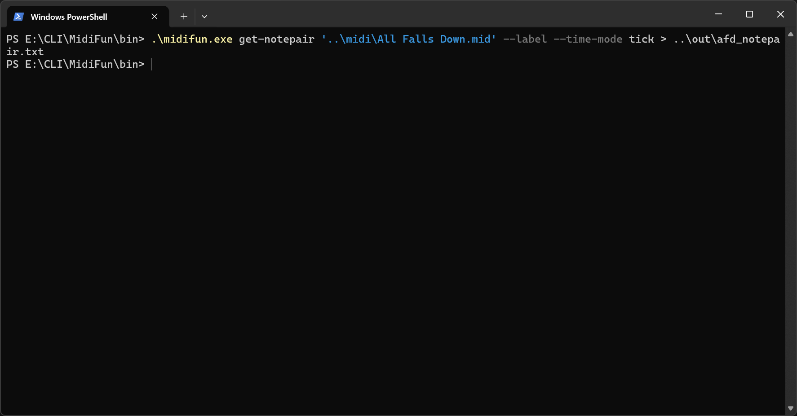

# MidiFun

MidiFun is a command-line tool for parsing and processing MIDI files, written in C++.

It's provides various subcommands to extract information, and perform MIDI in simple operations.

## Features

- Display MIDI file information

- Extract note (or notepair) data with customizable output fields

- Play MIDI files (Windows Only)

- Support for different time modes: tick(midi tick), microsecond(which means us)

- Filter events in some way

## Examples

<html>



</html>

## Dependencies

- [CLI11](https://github.com/CLIUtils/CLI11) - A modern, C++11/14/17 command line parser

- [MidiParse-v7](https://github.com/Gold-RsC/MidiParse-v7) - A MIDI file parser library written by me

## Usage

Download the `.exe` files from the repository.

And then run the executable file with the following command:

```
./MidiFun.exe [subcommand] [options]
```

<!-- AUTO_HELP_START -->
## Command Line Help

### Global options

```text
MidiFun, a tool to parse midi file easily


./bin/midifun.exe [OPTIONS] [SUBCOMMANDS]


OPTIONS:
  -h,     --help              Print this help message and exit
  -v,     --version           Display program version information and exit

SUBCOMMANDS:
  version                     Get version
  info                        Get MIDI info
  get-note                    Get MIDI notes
  get-notepair                Get MIDI note pairs
  play                        Play MIDI file
```

### `version` subcommand

```text
Get version


./bin/midifun.exe version [OPTIONS]


OPTIONS:
  -h,     --help              Print this help message and exit
```

### `info` subcommand

```text
Get MIDI info


./bin/midifun.exe info [OPTIONS] filepath


POSITIONALS:
  filepath TEXT:FILE REQUIRED Input MIDI file path

OPTIONS:
  -h,     --help              Print this help message and exit
  -v,     --verbose [0]       Print verbose info
          --head [0]          Print head info
          --track [0]         Print track info
          --time [0]          Print time info
          --text [0]          Print text info
          --note [0]          Print note info
          --bpm [0]           Print bpm info
          --channel [0]       Print channel info
          --time-mode ENUM:{microsecond->1,tick->0} [1]  
                              Time mode
          --time-bar UINT [50]  
                              Length of time bar
          --text-type ENUM:{device_name->9,instrument_name->4,lyric->5,marker->6,program_name->8,song_copyright->2,start_point->7,track_name->3,track_text->1} 
                              Text type
```

### `get-note` subcommand

```text
Get MIDI notes


./bin/midifun.exe get-note [OPTIONS] filepath


POSITIONALS:
  filepath TEXT:FILE REQUIRED Input MIDI file path

OPTIONS:
  -h,     --help              Print this help message and exit
          --time-mode ENUM:{microsecond->1,tick->0} [1]  
                              Time mode
          --label             Print label
          --filter-track UINT Track numbers
          --filter-channel UINT 
                              Channel numbers
          --content ENUM:{bar->6,beat->7,channel->2,instrument->5,pitch->3,time->0,track->1,velocity->4} ... 
                              Content to print
```

### `get-notepair` subcommand

```text
Get MIDI note pairs


./bin/midifun.exe get-notepair [OPTIONS] filepath


POSITIONALS:
  filepath TEXT:FILE REQUIRED Input MIDI file path

OPTIONS:
  -h,     --help              Print this help message and exit
          --time-mode ENUM:{microsecond->1,tick->0} [1]  
                              Time mode
          --label             Print label
          --filter-track UINT:INT in [0 - 127] 
                              Track numbers
          --filter-channel UINT:INT in [0 - 15] 
                              Channel numbers
          --content ENUM:{bar->6,beat->7,channel->2,instrument->5,pitch->3,time->0,track->1,velocity->4} ... 
                              Content to print
```

### `play` subcommand

```text
MidiPlay, a tool to play midi file easily


./bin/midiplay-win.exe [OPTIONS] [SUBCOMMANDS]


OPTIONS:
  -h,     --help              Print this help message and exit
  -v,     --version           Display program version information and exit

SUBCOMMANDS:
  note                        Play note
  midi                        Play midi file
```

<!-- AUTO_HELP_END -->

### Shell Redirection Operators

***Don't forget to use Shell Redirection Operators to redirect the output to a file!!!***

| Operator | Meaning | Explanation |
| :--- | :--- | :--- |
| **`>`** | **Redirect stdout** | Takes the standard output (usually the screen) of a command and writes it to a file. If the file already exists, it **overwrites** the file. |
| **`>>`** | **Append stdout** | Takes the standard output of a command and appends it to the end of a file. If the file does not exist, it is created. |
| **`2>`** | **Redirect stderr** | Takes the standard error output (error messages) of a command and writes it to a file. It **overwrites** the target file. |
| **`2>>`** | **Append stderr** | Takes the standard error output of a command and appends it to the end of a file. |
| **`&>`** | **Redirect both stdout and stderr** (Bash/Zsh) | Redirects both standard output and standard error to the same file, **overwriting** the file. (This is a Bash/Zsh shorthand). |
| **`&>>`** | **Append both stdout and stderr** (Bash/Zsh) | Appends both standard output and standard error to the same file. (Bash/Zsh shorthand). |
| **`2>&1`** | **Redirect stderr to stdout** | This does not send output to a file directly. Instead, it sends the standard error stream to wherever the standard output stream is currently going. It is often used to combine streams (e.g., `command > file.txt 2>&1`). |
| **`1>&2`** | **Redirect stdout to stderr** | Sends the standard output to the standard error stream. This is useful for writing script messages that should be treated as errors. |
| **`<`** | **Redirect stdin** | Takes the contents of a file and uses it as the standard input for a command. |
| **`<<`** | **Here Document** | Allows you to provide multiple lines of input directly in the shell script or command line until a specified delimiter is reached. |
| **`<<<`** | **Here String** | A variant of a here document. It takes a single string and passes it to the command as standard input. |
| **`<>`** | **Open file for reading and writing** | Opens a file for both reading and writing via the file descriptor. This is less common and typically used in advanced scripting. |

## License

MIT License